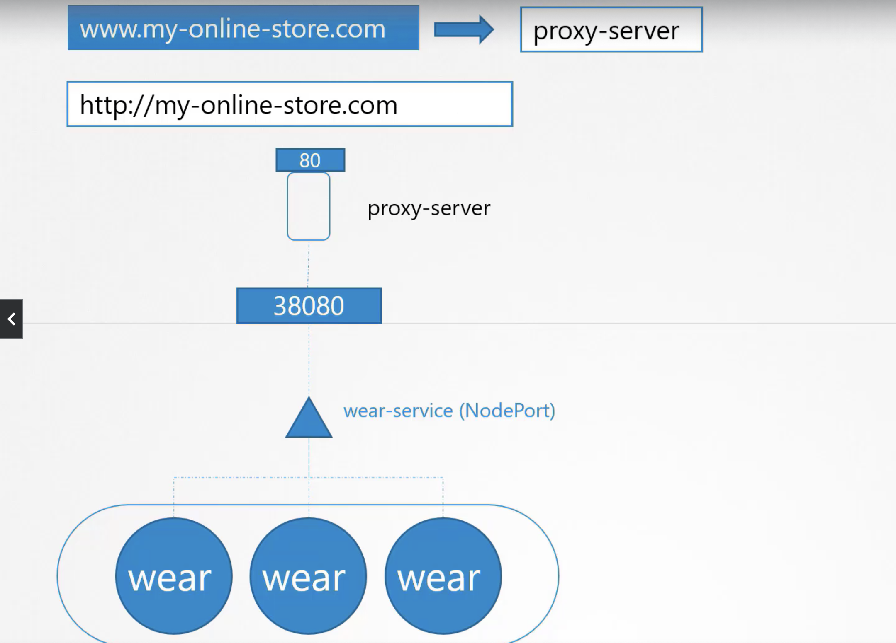

# Ingress Networking

You are deploying an application in kubernetes that has an online store selling products. Your application would be available at say `www.my-online-store.com`. You build the image into a docker image and deploy it in the kubernets cluster as a pod in a deployment. Your applicaiton needs a DB. So, you deploy a **mysql** db pod and create a service of type `cluster-ip`
To make the application accessible to the outside world, you make another service `wear-service` of type `NodePort`. Now the users can acees the application using any of the nodes followed by the nodeport. 
```
http://<node-ip>:38080
```
Whenever traffic increases we increase the no of pods and the service takes care of the load distribution. 


In production, you don't want you customers to remember your ip address, so you point your ip address to a url in a dns server and the customers can communicat using the URL.
```
http://my-online-store.com:38080
```
Now, you don't want your customers to remember the port number either.

So you bring a `proxy server` between the DNS Server and the application service. The proxy server will point port `80` to the service port of `38080`. Since the default port is 80, for the url, the user need not specify the port while communicating. 



All the above configuration is when you host your application in your data center.

If you deploy your application in a cloud provider. 

Instead of creating a service of type `NodePort` for you application, you create a service of type `LoadBalancer`. Kubernetes will do the same as `NodePort` and in addition to that k8 also sends a request to the cloud platform to provision a loadbalencer for the service. On receiving the request, the cloud provider will provide it's own load balancer, and that load balancer will have port 80 and it will point to the service and the nodeport. 


So far everything is good. 

The business expands and the store would open a streaming service. So the the services available would be something like this 

|URL | Service|
|----|--------|
|www.my-online-store.com/wear|wear-service|
|www.my-online-store.com/watch|watch-service|

